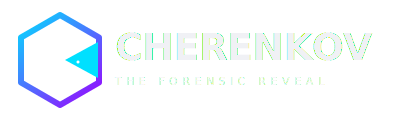

<p align="center">
  
</p>

<p align="center">
  <a href="https://cherenkov-security.com"><strong>cherenkov-security.com</strong></a> ·
  <a href="mailto:info@cherenkov-security.com">info@cherenkov-security.com</a>
</p>

<p align="center">
  
  
  
  
  
</p>

---

# CHERENKOV · The Sovereign Security Standard
**Precision in Sovereignty**

CHERENKOV is an air-gapped, sovereign AI security and quality intelligence platform. Designed explicitly for highly regulated infrastructures (EGY-FIN CSF, SAMA CSF, DORA), it tests traditional software, mobile applications, and embedded AI systems entirely on local hardware.

CHERENKOV operates on a mathematically provable "Trident of Truth": it finds vulnerabilities, proves them with non-destructive local execution, and cryptographically signs the evidence—without your source code, credentials, or customer data ever leaving your hardware.

---

## 🎯 At a Glance

| | |
|---|---|
| **Tagline** | The Forensic Reveal |
| **Architecture** | MEISSNER (Shield) · ABLATION (Sovereignty) · TOKAMAK (Proof) |
| **Governance** | SHA-256 signed WAL/WORM · Shred Receipts · Zero-Egress |
| **AI Stack** | Ollama-powered multi-agent swarm · LLM-driven scanner generation |
| **Compliance** | EGY-FIN CSF · SAMA CSF · DORA · ISO 27001-aligned |
| **Design System** | See [`DESIGN_SYSTEM.md`](DESIGN_SYSTEM.md) for brand guidelines |

---

## 📊 Current Status

| Item | Status |
|---|---|
| Security baseline | ✅ v0.1.1-security |
| Core architecture (11 files) | ✅ Phase 2 complete |
| P0 security fixes | ✅ PR #143 merged |
| Validated scanners | 🟡 5 of 50 target |
| TOKAMAK PoC execution | ⬜ Phase 4 |
| Cairo pilot | ⬜ Phase 6 |

---

## 🛡️ The Trident Architecture

The platform divides cognitive execution across a highly restricted multi-agent swarm, governed by strict physical and cryptographic boundaries.

### 1. MEISSNER (The Shield)
The fail-closed network perimeter. MEISSNER drops all unauthorized outbound connections, physically severing local execution nodes from the external internet to enforce absolute zero-egress.

### 2. ABLATION (Sovereignty)
The redaction engine. In hybrid configurations, any data requiring cloud processing is forced through ABLATION, which strips all PII, credentials, and proprietary code before egress is permitted.

### 3. TOKAMAK (The Proof)
The validation tokamak. No HIGH/CRITICAL finding is reported without Tokamak executing a live, non-destructive Proof of Concept (PoC) against the target.

### 📜 Cherenkov Trace & Evidence Governance
Every action is recorded via SQLite WAL/WORM storage and signed with a SHA-256 cryptographic hash. This generates legally binding **Shred Receipts** for compliance audits, proving both the vulnerability and the subsequent cryptographic erasure of the test data.

---

## 🚀 Quick Start (Air-Gapped Local Deployment)

CHERENKOV is built for Docker-native, offline execution. 

```bash
# 1. Clone the repository
git clone https://github.com/moaidmoatasem/cherenkov-professional.git
cd cherenkov-professional

# 2. Configure environment
cp .env.example .env

# 3. Start the stack
docker-compose -f deploy/docker-compose.yml up
```

## ⚖️ Licensing & The Ethical Open-Core
We refuse to utilize the "SSO Wall of Shame." Core security features (SSO, RBAC, audit logging, local scanning) are provided under **MIT/Apache**. The proprietary multi-agent orchestrator and advanced Arabic RTL/OCR modules are dual-licensed (**AGPLv3/BSL**) to protect localized intelligence from hyperscaler cannibalization.

---

<p align="center">
  <sub>Built with discipline. Released with purpose.</sub><br>
  <a href="https://cherenkov-security.com"><strong>cherenkov-security.com</strong></a> ·
  <a href="mailto:info@cherenkov-security.com">info@cherenkov-security.com</a>
</p>

<p align="center">
  <a href="DESIGN_SYSTEM.md">🎨 Design System</a> ·
  <a href="docs/">📚 Documentation</a> ·
  <a href="https://docs.cherenkov-security.com/">🌐 docs.cherenkov-security.com</a> ·
  <a href="docs/PROJECT_BRIEFING.md">📋 Project briefing</a> ·
  <a href="ARCHITECTURE.md">🏗️ Architecture</a> ·
  <a href="CONTRIBUTING.md">🤝 Contributing</a>
</p>

---
<p align="center">
  <sub>CHERENKOV v1.0 · Phase 1 Enforced · MTH-9941-R</sub>
</p>
