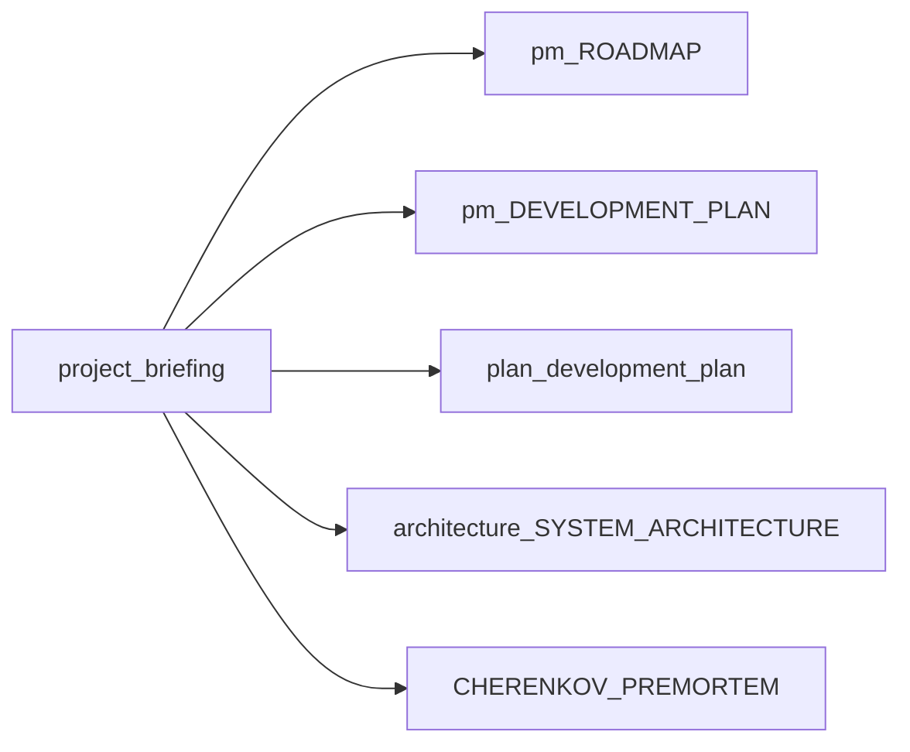
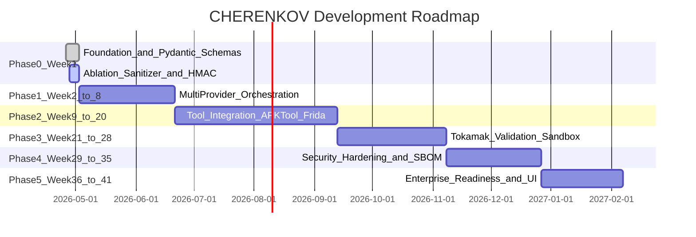

# Project briefing (single entry)

This document is the **canonical onboarding and navigation hub** for roadmap, execution plans, architecture, progress framing, curated technical debt, and major risks. It does **not** replace long-form specs; it links to them.

---

## At a glance

CHERENKOV is scoped as an air-gapped, sovereign security intelligence stack organized around three boundaries:

| Boundary | Role |
|----------|------|
| **MEISSNER** | Fail-closed network perimeter (zero egress). |
| **ABLATION** | Redaction / sanitization when data crosses trust boundaries. |
| **TOKAMAK** | Isolated validation and cryptographically attributable evidence for findings. |

**Read next:** [Product roadmap](pm/ROADMAP.md) for release phases and goals, then [System architecture](architecture/SYSTEM_ARCHITECTURE.md) for cognitive routing and the Trident model.

---

## Document hub

| Layer | Purpose | Primary documents |
|-------|---------|---------------------|
| **TPM / roadmap** | Strategy, phases, milestones | [pm/ROADMAP.md](pm/ROADMAP.md), [pm/ROADMAP_FOR_WEB.md](pm/ROADMAP_FOR_WEB.md), [github/RELEASES.md](github/RELEASES.md) |
| **Execution plans** | Sprints and deep phased plan | [pm/DEVELOPMENT_PLAN.md](pm/DEVELOPMENT_PLAN.md), [plan/development_plan.md](plan/development_plan.md) |
| **Progress timeline** | Gantt-style phased view | [plan/ROADMAP_PROGRESS.md](plan/ROADMAP_PROGRESS.md) |
| **Architecture** | System design and diagrams | [architecture/SYSTEM_ARCHITECTURE.md](architecture/SYSTEM_ARCHITECTURE.md), [architecture/HLD_DIAGRAM.md](architecture/HLD_DIAGRAM.md), [architecture/LLD_DIAGRAM.md](architecture/LLD_DIAGRAM.md), [../ARCHITECTURE.md](../ARCHITECTURE.md) |
| **System design & patterns** | HLD/LLD narrative, patterns | [pm/SYSTEM_DESIGN.md](pm/SYSTEM_DESIGN.md), [pm/DESIGN_PATTERNS_BEST_PRACTICES.md](pm/DESIGN_PATTERNS_BEST_PRACTICES.md) |
| **Processes** | Engineering workflow | [processes/DEVELOPMENT_WORKFLOW.md](processes/DEVELOPMENT_WORKFLOW.md) |
| **Living backlog / status** | Checklists and headline status | [../TODO.md](../TODO.md), [../STATUS.md](../STATUS.md) |
| **Governance / PM rules** | Branches, milestones, labels | [../AGENTS.md](../AGENTS.md) |
| **Product / narrative SSOT** | Sovereign framing | [../CHERENKOV_SSOT.md](../CHERENKOV_SSOT.md), [../CHERENKOV_SOVEREIGN_BLUEPRINT.md](../CHERENKOV_SOVEREIGN_BLUEPRINT.md) |
| **Risk exercise** | Prospective failure modes | [../CHERENKOV_PREMORTEM.md](../CHERENKOV_PREMORTEM.md) |

---

## Progress

### Timeline (from roadmap progress doc)

Synced with [plan/ROADMAP_PROGRESS.md](plan/ROADMAP_PROGRESS.md).

That document’s status overview: **Phase 0 in progress**; **Phases 1–5 planned**.

### How to reconcile status

Multiple artifacts track “where we are.” They emphasize different lenses; **CI results, merged code, and GitHub issues** should win when they disagree with prose.

| Source | What it measures |
|--------|------------------|
| [plan/ROADMAP_PROGRESS.md](plan/ROADMAP_PROGRESS.md) | Calendar-style phases (Week 1–41 style). |
| [pm/ROADMAP.md](pm/ROADMAP.md) | Product phases aligned to releases **v1.0.0-rc1** through **v2.5.0**. |
| [AGENTS.md](../AGENTS.md) | Official **milestones** (`v1.0.0-rc1` … `v2.5.0`) for issue/PR linkage. |
| [TODO.md](../TODO.md) | Checkbox backlog (phases, PM setup, next actions). |
| [STATUS.md](../STATUS.md) | Short operational headline and roadmap bullets. |

If [TODO.md](../TODO.md) and [STATUS.md](../STATUS.md) diverge (e.g. tests or phase labels), treat that as a signal to **update one or both** in a dedicated docs pass—not as contradictory truth.

---

## Technical debt (curated)

These items are **signals for triage**, not an exhaustive audit. Verify in code before prioritizing fixes.

| Theme | Notes | Evidence |
|-------|--------|----------|
| **Vision vs codebase gap** | Historical deep review listed few validated scanners vs many generated candidates, scaffold AI integration, persistence gaps, and repo layout debt. | [plan/development_plan.md](plan/development_plan.md) §2 — *dated snapshot; re-validate.* |
| **Low coverage bar** | CI allows reporting with `fail_under = 25`. | [pyproject.toml](../pyproject.toml) `[tool.coverage.report]` |
| **Stub / TODO clusters** | Orchestration iterations and dev-crew scaffolding not fully wired. | [packages/cherenkov/dev_crew/scanner_generator.py](../packages/cherenkov/dev_crew/scanner_generator.py), [packages/cherenkov/orchestration/ai_workflows_orchestrator.py](../packages/cherenkov/orchestration/ai_workflows_orchestrator.py), [scripts/](../scripts/) swarm iteration scripts |
| **Web entrypoint drift** | Multiple `cherenkov_web` entrypoints exist; behaviour (e.g. `debug`, `host`) may differ by path. Root [cherenkov_web.py](../cherenkov_web.py) calls `app.run(debug=True, host="0.0.0.0", port=5000)`; env-gated variants exist under `scripts/` and `src/`. **Reconcile or deprecate** after grep/usage audit. |
| **Governance vs implementation** | Policy and architecture docs may outpace enforced controls in code (see risks). | [CHERENKOV_PREMORTEM.md](../CHERENKOV_PREMORTEM.md) |

---

## Challenges and risks (short list)

From [pm/ROADMAP.md](pm/ROADMAP.md): delivering **parallel swarm orchestration**, **enterprise HITL/compliance**, **mobile exploitation stack**, and **ecosystem export (SARIF, CI)** while preserving **zero-egress** assurances—each phase increases operational and assurance burden.

From [CHERENKOV_PREMORTEM.md](../CHERENKOV_PREMORTEM.md) summary (representative prevention themes):

| Failure mode | Preventive theme |
|--------------|------------------|
| Planning heavy, shipping light | Enforce commit-first cadence vs new planning artifacts. |
| Ablation drops too much evidence | Telemetry, partial redaction fallback, staged real payloads. |
| Tokamak timeouts wrong for surface | Profile-aware timeouts (e.g. web vs mobile/boot). |
| Scanner candidates not validated | Automated nightly validation gates (targets + CI). |
| Credibility gap (marketing vs reality) | README and public claims track **validated** capabilities. |

See the premortem for the full retrospective table and prescriptions.

---

## Maintenance

Update this briefing when roadmap, milestone, or progress docs change materially—**at minimum** alongside a release tag or sprint close. Prefer a single small PR that adjusts links and debt bullets rather than expanding this file into duplicate long-form prose.
