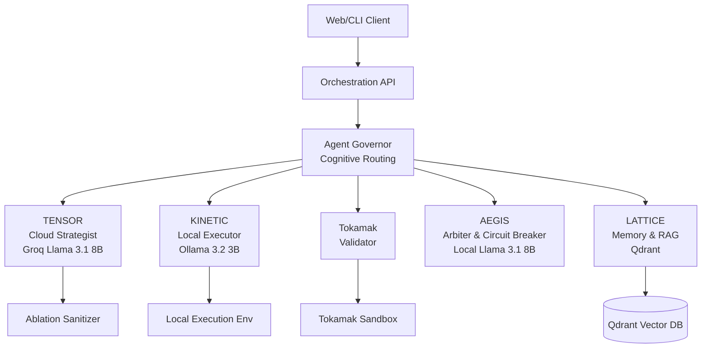

# High-Level Design (HLD)

The following diagram provides a high-level view of the CHERENKOV system architecture.

```mermaid
graph TD
    Client[Web/CLI Client] --> Orchestrator[Orchestration API]
    Orchestrator --> AgentGovernor[Agent Governor\nCognitive Routing]
    AgentGovernor --> TENSOR[TENSOR\nCloud Strategist\nGroq Llama 3.1 8B]
    AgentGovernor --> KINETIC[KINETIC\nLocal Executor\nOllama 3.2 3B]
    AgentGovernor --> TOKAMAK[Tokamak\nValidator]
    AgentGovernor --> AEGIS[AEGIS\nArbiter & Circuit Breaker\nLocal Llama 3.1 8B]
    AgentGovernor --> LATTICE[LATTICE\nMemory & RAG\nQdrant]

    TENSOR --> Sanitizer[Ablation Sanitizer]
    KINETIC --> LocalEnv[Local Execution Env]
    TOKAMAK --> Sandbox[Tokamak Sandbox]
    LATTICE --> VectorStore[(Qdrant Vector DB)]
```
