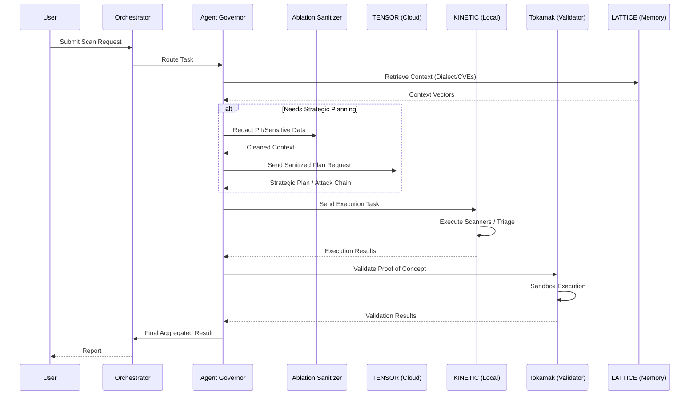

# Low-Level Design (LLD)

The following diagram details the interactions and components within the multi-agent swarm.

```mermaid
sequenceDiagram
    participant User
    participant Orchestrator
    participant Governor as Agent Governor
    participant Sanitizer as Ablation Sanitizer
    participant Tensor as TENSOR (Cloud)
    participant Kinetic as KINETIC (Local)
    participant Tokamak as Tokamak (Validator)
    participant Lattice as LATTICE (Memory)

    User->>Orchestrator: Submit Scan Request
    Orchestrator->>Governor: Route Task
    Governor->>Lattice: Retrieve Context (Dialect/CVEs)
    Lattice-->>Governor: Context Vectors

    alt Needs Strategic Planning
        Governor->>Sanitizer: Redact PII/Sensitive Data
        Sanitizer-->>Governor: Cleaned Context
        Governor->>Tensor: Send Sanitized Plan Request
        Tensor-->>Governor: Strategic Plan / Attack Chain
    end

    Governor->>Kinetic: Send Execution Task
    Kinetic->>Kinetic: Execute Scanners / Triage
    Kinetic-->>Governor: Execution Results

    Governor->>Tokamak: Validate Proof of Concept
    Tokamak->>Tokamak: Sandbox Execution
    Tokamak-->>Governor: Validation Results

    Governor->>Orchestrator: Final Aggregated Result
    Orchestrator-->>User: Report
```
