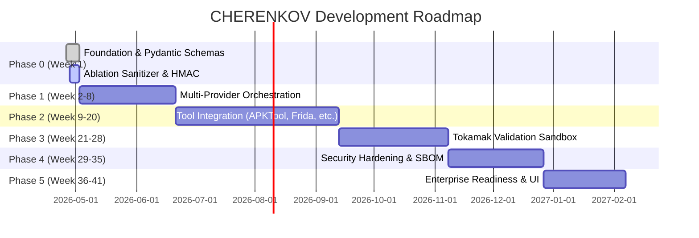

# Roadmap & Progress

## Timeline Summary

```mermaid
gantt
    title CHERENKOV Development Roadmap
    dateFormat  YYYY-MM-DD
    section Phase 0 (Week 1)
    Foundation & Pydantic Schemas :done, p0, 2026-04-26, 7d
    Ablation Sanitizer & HMAC :active, p0_2, 2026-04-28, 5d
    section Phase 1 (Week 2-8)
    Multi-Provider Orchestration :p1, 2026-05-03, 49d
    section Phase 2 (Week 9-20)
    Tool Integration (APKTool, Frida, etc.) :p2, 2026-06-21, 84d
    section Phase 3 (Week 21-28)
    Tokamak Validation Sandbox :p3, 2026-09-13, 56d
    section Phase 4 (Week 29-35)
    Security Hardening & SBOM :p4, 2026-11-08, 49d
    section Phase 5 (Week 36-41)
    Enterprise Readiness & UI :p5, 2026-12-27, 42d
```

## Status Overview
- **Phase 0:** In Progress
- **Phase 1-5:** Planned
